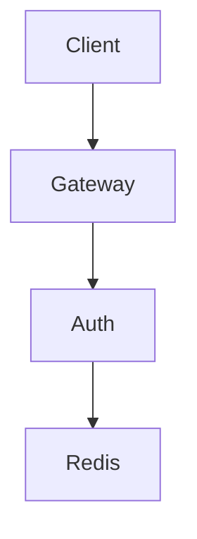

# Identity Platform (Go)

MSA 환경에서 재사용 가능한 인증/세션 인프라를 설계하고 구현한 Go 기반 플랫폼입니다.

---

## 🎯 Objective

본 프로젝트는 단순 로그인 서버가 아니라,
여러 서비스에서 공통으로 사용할 수 있는 **인증/세션 인프라 플랫폼**을 구축하는 것을 목표로 합니다.

다음과 같은 문제를 해결하고자 합니다:

- JWT 기반 인증에서 Logout 즉시 반영이 어려운 문제
- Refresh Token 재사용(replay) 및 중복 요청 문제
- 서비스별 인증 로직 중복 및 정책 불일치 문제
- 장애 상황에서의 일관되지 않은 인증 처리

---

## 🏗 Architecture



---

## 🔑 Key Design

### 1. Authentication Centralization (Gateway)

인증(Authentication)은 Gateway에서 수행됩니다.

- JWT Access Token 검증
- 인증 실패 처리
- 사용자 식별자 추출 및 전달 (X-User-ID)
- 인증 경계 강제 (X-Gateway-Verified)

서비스는 JWT를 직접 검증하지 않고, Gateway가 전달한 사용자 컨텍스트를 신뢰합니다.

---

### 2. JWT + Redis Hybrid Model

JWT의 Stateless 특성과 Redis의 상태 관리 기능을 결합한 구조를 사용합니다.

- JWT: 인증 토큰
- Redis: 세션 상태 관리

이를 통해 다음을 가능하게 합니다:

- Logout 즉시 반영
- 세션 기반 접근 제어
- Refresh Token 상태 관리

---

### 3. Session-Based Access Control

Access Token이 유효하더라도,
Redis 세션이 존재하지 않으면 요청을 거부합니다.

```
Access Token valid + Session 없음 → 401 Unauthorized
```

---

### 4. Refresh Token Control

Refresh Token은 다음 조건을 만족해야 합니다:

- 서명 검증 통과
- 만료되지 않음
- Redis에 저장된 JTI와 일치
- 세션 존재

또한, Refresh Token은 1회 사용 원칙(Rotation)을 따릅니다.

---

## 🔄 Request Flow

### Login

1. 사용자 인증
2. Access Token 발급
3. Refresh Token 발급
4. Redis 세션 생성

---

### Protected API (/me)

1. Gateway에서 JWT 검증
2. X-User-ID 헤더 주입
3. Auth 서비스에서 Redis 세션 확인
4. 응답 반환

---

### Logout

1. Redis 세션 삭제
2. 이후 모든 요청은 세션 없음으로 거부됨

---

### Refresh

1. Refresh Token 검증
2. Redis 상태 확인 (JTI + Session)
3. 새로운 Access Token 발급
4. Refresh Rotation 수행

---

## 📚 Documentation

- [API Contract](docs/api-contract.md): Gateway/Auth API 경로, 요청/응답 형식, 상태 코드, downstream service 연동 계약을 정리합니다.
- [Architecture](docs/architecture.md): Gateway, Auth, Redis 기반 전체 인증 플랫폼 구조와 설계 의도를 설명합니다.
- [Request Flows](docs/request-flows.md): login, protected API, logout, refresh 요청 흐름을 단계별로 정리합니다.
- [Redis Design](docs/redis-design.md): session marker, refresh JTI, idempotency lock, rate limit Redis key 정책을 설명합니다.
- [Failure Scenarios](docs/failure-scenarios.md): token 실패, session 없음, Redis 장애, upstream 장애 등 주요 실패 상황과 응답 정책을 정리합니다.
- [ADR](docs/adr/): Redis session, refresh rotation, idempotency, rate limit 등 주요 설계 결정을 기록합니다.
- Policy:
  - [Auth Boundary Policy](docs/policy/auth-boundary.md): Gateway 중심 인증 경계와 `X-User-ID` 전달 정책을 설명합니다.
  - [Session Policy](docs/policy/session-policy.md): Redis Session을 active login marker로 사용하는 정책을 설명합니다.
  - [Refresh Policy](docs/policy/refresh-policy.md): Refresh Token 검증, Session 확인, rotation, idempotency 정책을 정리합니다.
  - [Error Policy](docs/policy/error-policy.md): 인증 실패, 권한 실패, upstream 실패 등 공통 에러 응답 기준을 정리합니다.

---

## ⚖️ Trade-offs

### Gateway Centralization

장점:

- 인증 로직 중앙화
- 중복 제거

단점:

- Gateway 의존성 증가
- 내부 신뢰 모델 필요

---

### JWT + Redis

장점:

- Logout 즉시 반영
- 세션 제어 가능

단점:

- Redis 의존성 추가
- 상태 관리 필요

---

## 🧪 Verification

다음 시나리오를 통해 검증하였습니다:

- Login → 200
- Protected API → 200
- Logout → 204
- Logout 이후 Protected API → 401
- Refresh → 정상 발급
- Logout 이후 Refresh → 401
- Gateway 우회 요청 차단

---

## 📊 Result

본 구조를 통해 다음을 달성하였습니다:

- 인증 로직을 Gateway로 중앙화하여 서비스 간 중복 제거
- Redis 기반 세션 관리로 Logout 즉시 반영 가능
- Refresh Token 재사용 방지 및 안정적인 재발급 흐름 구현
- 인증 실패 및 장애 상황에 대한 일관된 정책 수립

또한, 다음과 같은 시나리오를 검증하였습니다:

- Login → 200
- Protected API → 200
- Logout → 204
- Logout 이후 요청 → 401
- Refresh 정상 동작 및 세션 기반 차단 확인

---

## 🚀 Future Work

- Token Revocation / Global Logout
- RBAC (Authorization)
- Observability (Tracing / Metrics)
- Kafka 기반 Event-Driven 확장
- mTLS / Service Mesh 기반 내부 통신 강화

---

## 📌 Summary

본 프로젝트는 인증을 Gateway로 중앙화하고,
Redis 기반 세션을 통해 JWT의 한계를 보완한
**운영 관점의 인증 플랫폼 설계 및 구현 사례**입니다.
