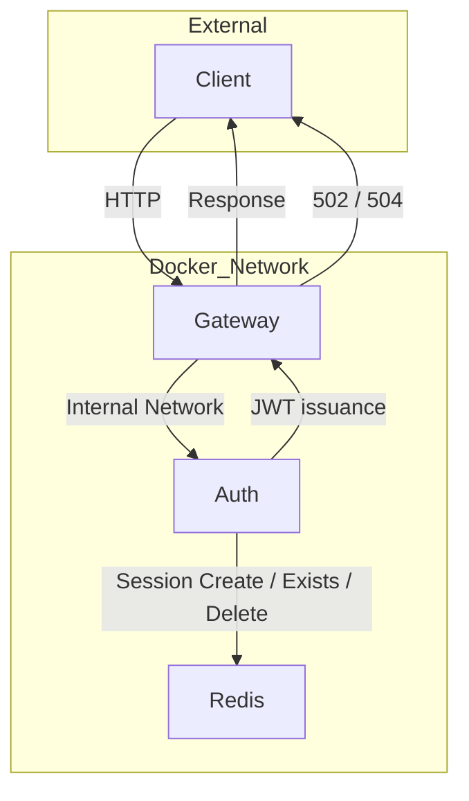

# Identity Platform (Go)

플랫폼 관점으로 설계된 인증 및 세션 인프라 시스템

---

## 🎯 Objective

단순 로그인 서버가 아니라,
MSA 환경에서 재사용 가능한 **공용 인증 인프라**를 설계/구현하는 것이 목표입니다.

이 프로젝트는 다음을 중점적으로 다룹니다:

- Gateway 강제 경계 분리
- 인증 실패 정책 통일
- Upstream timeout 및 장애 분류
- Redis 기반 세션 관리
- Refresh Rotation / Idempotency / Rate Limiting 으로 확장 가능한 구조 설계

---

## 🏗  Architecture

Client  
  ↓  
Gateway (Reverse Proxy)  
  - StripPrefix  
  - X-Gateway-Verified 강제  
  - Upstream Timeout 설정  
  - 502 / 504 Error Mapping  

  ↓  
Auth Service  
  - JWT Access 발급  
  - Middleware 인증 처리  
  - Redis 세션 생성 / 검증 / 삭제  
  - /me 보호 API  

  ↓  
Redis  
  - Session TTL 관리 
  - Session 존재 여부 검증  

---

## 🏗 Architecture Diagram



---

## 🔐 Core Features (Current Scope)

### 1️⃣ JWT Authentication
- Typed Claims 구조체 사용
- Access Token 발급
- Middleware 기반 인증 검증
- 에러 정책 통일 (unauthorized)

### 2️⃣ Gateway Boundary Enforcement
- Auth 서버 직접 접근 차단.
- Gateway를 반드시 통과하도록 헤더 기반 검증 적용.

→ MSA 환경에서 공용 인증 인프라 구조를 모사

### 3️⃣ Redis-backed Session Management
- Redis 기반 세션 저장소 구현
- 로그인 시 세션 생성
- 보호 API 접근 시 세션 존재 여부 검증
- 로그아웃 시 세션 삭제
- TTL 기반 자동 만료

→ JWT만 검증하는 것이 아니라, 서버 측 세션 상태까지 확인하는 구조

### 3️⃣ Reliability & Failure Handling
- Upstream Dial / Response Timeout 설정
- Connection 실패 → 502 Bad Gateway
- Timeout 발생 → 504 Gateway Timeout
- 인증 실패 응답 통일

→ 장애 상황에서도 예측 가능한 동작 보장

---

## 🧠 Design Principles

### ✔ Platform First
비즈니스 로직보다 “인프라적 사고”를 우선.

### ✔ Failure is Expected
Timeout, Upstream 실패를 정상 흐름으로 간주하고 명시적 처리.

### ✔ Explicit Boundary
서비스 간 경계를 코드 레벨 + 네트워크 레벨에서 강제.

### ✔ Stateful Validation over Stateless JWT Only
Access Token만 신뢰하지 않고,
Redis 세션 상태를 함께 확인하여 서버 측 무효화(logout) 가능성을 확보.

### ✔ Extensible Structure
Redis 세션, Refresh Rotation, Idempotency, Async Hook을
추가해도 구조 변경이 최소화되도록 설계.

---

## 🗂 Project Structure

```
identity-platform/
├── cmd/
│   ├── auth/        # auth service entrypoint
│   └── gateway/     # gateway service entrypoint
│
└── internal/
    ├── auth/        # token issuance & domain logic
    │   ├── tokens.go
    │   ├── errors.go
    │   └── session_store.go
    │
    ├── config/
    │   └── config.go
    │
    ├── gateway/
    │   ├── proxy.go
    │   └── mw/
    │       └── inject_user.go
    │
    ├── mw/
    │   ├── jwt_auth.go
    │   └── gateway_required.go
    │
    └── store/
        └── redis.go
```

서비스 진입점(cmd)과 내부 로직(internal)을 분리하고, JWT 로직과 세션 저장 로직을 분리하여
확장 가능성과 테스트 용이성을 고려.

---

## ▶️ How to Run
```Bash
docker compose up --build
```

Docker Compose는 다음 서비스를 함께 실행합니다:

- Gateway
- Auth
- Redis

외부 공개 포트는 Gateway만 사용하며, Auth는 내부 네트워크를 통해서만 접근합니다.

---

## ✅ Testing
```Bash
go test ./...
```

현재 테스트는 다음을 포함합니다:

- Gateway 헤더가 없는 요청 차단
- Gateway 헤더는 있지만 토큰이 없는 요청 차단
- 세션 저장소 주입 구조에 맞춘 라우터 테스트 유지

---

## 🚧 Next Phase (Redis Integration - Identity MVP v1)

- Refresh Token 발급
- /auth/refresh API 추가
- Refresh Token Rotation (현재 유효 refresh jti 1개 유지)
- Refresh Idempotency 처리 (SET NX + TTL 기반 중복 요청 방지)
- Basic Rate Limiting (INCR + TTL 기반 고정 윈도우)

---

## 🔭 Future Enhancements (Post-MVP)

- Structured Logging (traceID 포함)
- Async Audit Hook 연동
- Observability 확장 (metrics / error classification)
- Advanced Security Policies (reuse detection, multi-device session 등)

---

## 🛠 Tech Stack

- Go
- Gin
- Docker / Docker Compose
- Reverse Proxy (net/http/httputil)
- Redis