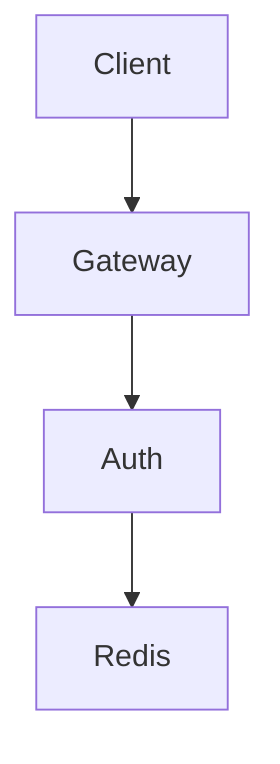

# Architecture

## Overview

Identity Platform은 단순 로그인 서버가 아니라,  
MSA 환경에서 재사용 가능한 **공용 인증/세션 인프라**를 목표로 설계된 Go 기반 플랫폼입니다.

이 프로젝트는 다음 문제를 해결하려고 합니다:

- JWT only 구조의 한계에 따른 Logout 제어 문제
- Refresh token replay 및 중복 요청 처리 문제
- 인증 경계가 서비스마다 반복될 때 생기는 복잡성
- 장애 상황에서의 정책 불일치

따라서 이 플랫폼은 **Gateway + Auth + Redis** 구조를 통해  
인증 진입점, 세션 검증, 토큰 갱신 정책, 장애 대응 정책을 중앙에서 일관되게 관리합니다.

---

## High-Level Architecture

---

## Components

### Client

외부 사용자는 직접 내부 인증 서비스에 접근하지 않고, Gateway를 통해 요청을 전달합니다.

### Gateway

Gateway는 인증 인프라의 **외부 진입점**입니다.

주요 역할:

- JWT 인증 검증
- 공통 인증 실패 처리
- 내부 서비스로 reverse proxy
- 인증된 사용자 컨텍스트 전달 (예: X-Gateway-Verified, X-User-ID)
- 보호 API 요청에 대해서만 JWT 검증 수행 후 헤더 주입
- 공개 API (login, refresh)는 검증 없이 프록시
- upstream timeout 및 오류 매핑

Gateway는 여러 서비스에서 반복되는 인증 로직을
**공통 계층으로 중앙화**하는 역할을 합니다.

### Auth Service

Auth Service는 실제 인증 기능을 담당하는 서비스입니다.

주요 책임:

- 로그인 처리
- JWT access token / refresh token 발급
- /me 보호 API 제공
- logout 처리
- refresh rotation 처리
- refresh idempotency 처리
- Redis 기반 session / refresh 상태 검증
- rate limit 적용

Auth Service는 인증 기능 자체를 담당하며
다른 서비스들이 사용할 수 있는 **공용 인증 서비스**로 설계되었습니다.

또한 Auth Service는 JWT를 직접 검증하지 않으며,
Gateway가 전달한 인증 결과를 기반으로 세션 및 인증 상태를 처리합니다.

### Redis

Redis는 이 플랫폼에서 단순 캐시가 아니라
**세션 상태 저장소이자 인증 보조 상태 저장소** 역할을 합니다.

주요 역할:

- 세션 TTL 기반 관리
- 현재 유효 refresh jti 저장
- refresh idempotency lock 저장
- rate limit 카운터 저장

Redis를 사용하여 stateless JWT 구조를 유지하면서도
운영에서 필요한 상태 제어 기능을 제공합니다.

---

## Authentication Responsibility

이 구조에서는 **인증(Authentication)** 과 **권한(Authorization)** 의 책임을 분리합니다.

### Gateway

Gateway는 다음을 담당합니다.

- JWT 유효성 검증
- 토큰 만료 검사
- 인증 실패 처리
- 사용자 컨텍스트 전달

즉 인증(Authentication) 은 Gateway에서 중앙화됩니다.

Gateway는 보호 API 요청에 대해서만 JWT를 검증하며,
검증 성공 시 사용자 식별 정보를 내부 헤더로 전달합니다.
공개 API (login, refresh)는 토큰 없이 접근 가능하며 Gateway는 이를 그대로 전달합니다.

### Service

각 서비스는 Gateway가 전달한 사용자 컨텍스트를 기반으로

- 도메인 권한 검사
- 리소스 접근 제어
- 비즈니스 로직 처리

를 담당합니다.

서비스는 JWT 자체를 다시 검증하기보다는
사용자 컨텍스트를 활용하여 권한(Authorization) 과
도메인 로직에 집중합니다.

---

## Why This Architecture

### Authentication Centralization

인증 로직은 대부분의 서비스에서 반복되는 공통 기능입니다.

각 서비스가 JWT 검증을 직접 구현하면 다음 문제가 발생합니다.

- 중복 코드 증가
- 인증 정책 불일치
- 유지보수 비용 증가

따라서 인증 검증은 Gateway에서 중앙화하고
서비스는 인증 결과를 기반으로 동작하도록 역할을 분리했습니다.

### JWT + Redis Hybrid Model

JWT만 사용할 경우 다음 문제가 있습니다.

- logout 이후에도 토큰이 일정 시간 유효
- refresh token replay 문제
- 서버에서 로그인 상태 제어 어려움

이 프로젝트는 JWT 기반 인증 구조에 Redis 상태를 결합하여
운영에서 필요한 제어 기능을 추가했습니다.

---

## Design Principles

### Clear Responsibility Separation

각 컴포넌트는 명확한 책임을 갖습니다.

Gateway
→ 인증 공통 처리

Auth Service
→ 인증 기능 제공

Service
→ 도메인 권한 검사 및 비즈니스 로직

이 구조는 서비스 간 책임을 명확히 분리합니다.

### Minimal State Control

JWT 기반 인증의 장점을 유지하면서
필요한 최소 상태만 Redis에 저장합니다.

저장되는 상태:

- session 존재 여부
- refresh token jti
- refresh idempotency lock
- rate limiting counter

### Production-Oriented Simplicity

이 프로젝트는 복잡한 인증 프레임워크 대신
운영에서 자주 필요한 기능을 중심으로 설계되었습니다.

- JWT 기반 인증
- Redis 기반 세션 관리
- refresh rotation
- idempotency 처리
- rate limiting

### Reliability and Failure Handling

인증 시스템은 실패를 명확히 분류해야 합니다.

예:

- invalid token → 401
- expired token → 401
- rate limit exceeded → 429
- upstream timeout → 504
- upstream connection failure → 502

Gateway는 이러한 오류를 명확히 분리하여
클라이언트가 실패 원인을 구분할 수 있도록 합니다.

---

## Trade-offs

### Gateway Centralization vs Internal Trust Dependency

인증 검증을 Gateway로 중앙화하면 서비스별 중복 인증 로직을 줄이고
구조를 단순하게 유지할 수 있습니다.

하지만 그만큼 Gateway가 인증 신뢰 경계의 핵심이 되므로
내부 서비스는 Gateway를 통과한 요청을 전제로 동작하게 됩니다.

즉 이 구조는 서비스 단의 인증 재검증 복잡성을 줄이는 대신
Gateway 및 내부 네트워크 경계에 더 강하게 의존하는 trade-off를 가집니다.

### Stateless Simplicity vs Operational Control

JWT only 구조는 단순하지만 운영 제어 기능이 제한됩니다.

Redis를 추가하면 다음 기능을 얻을 수 있습니다.

- logout 즉시 적용
- refresh replay 방어
- 세션 강제 종료
- rate limiting

이 프로젝트는 **운영 제어 기능을 강화하는 방향**을 선택했습니다.

---

## Future Evolution

현재 구조는 MVP 기반 인증 플랫폼이며
다음 방향으로 확장할 수 있습니다.

token revocation
global logout
observability 확장 (metrics, tracing)

### Internal Service Trust Hardening

운영 환경에서는 Gateway 경계 외에도
내부 서비스 간 통신 보호를 강화할 수 있습니다.

예를 들어 다음과 같은 방식이 있습니다.

- mTLS 기반 서비스 간 인증
- service mesh (Envoy / Istio)
- 서비스 identity 기반 접근 제어

이러한 방식은 서비스 간 통신을 cryptographic identity로 검증하여
내부 네트워크에서도 더 강한 신뢰 모델을 구축할 수 있습니다.
