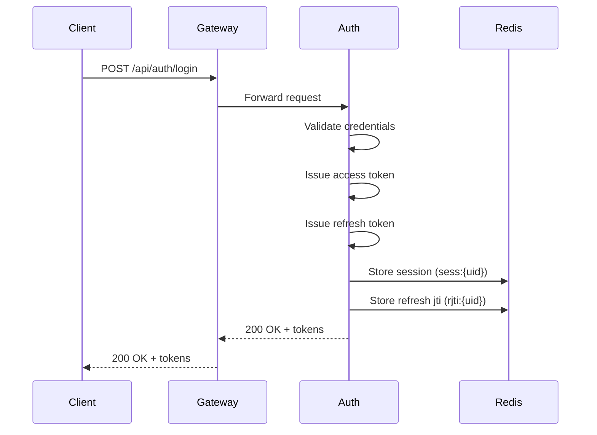
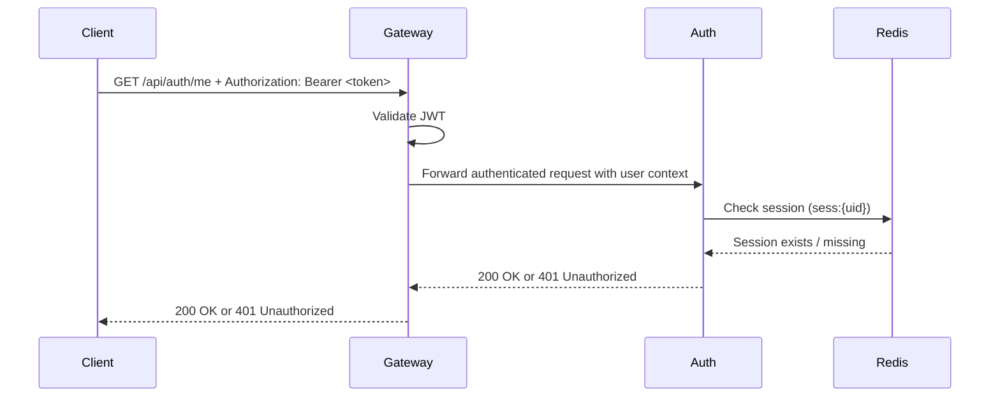
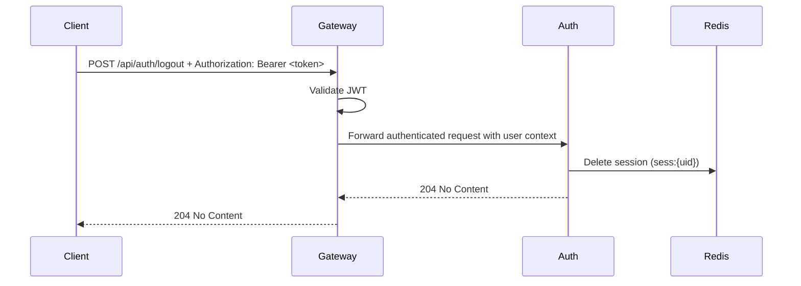
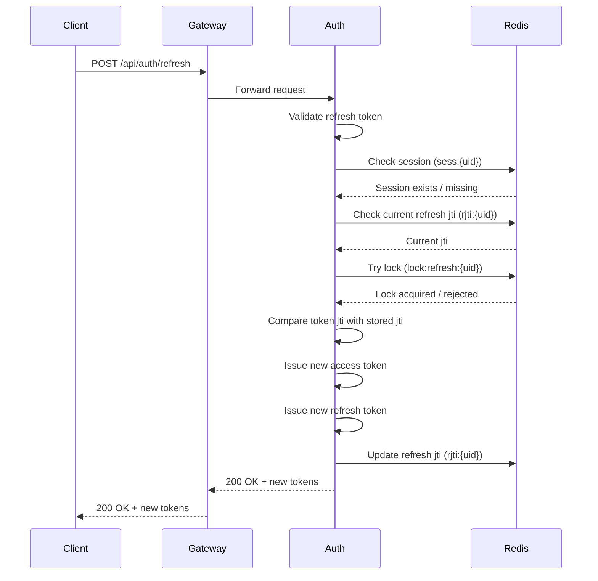

# Request Flows
이 문서는 Identity Platform의 주요 요청 흐름을 설명합니다.

대상 흐름:

- Login Flow
- Protected API Flow
- Logout Flow
- Refresh Flow

이 구조에서 모든 외부 요청은 Gateway를 통해 진입하며,  
Gateway는 인증 공통 처리를 담당하고 내부 서비스로 요청을 전달합니다.

## Login Flow
사용자가 username / password로 로그인하고  
Access Token과 Refresh Token을 발급받는 흐름입니다.

### Flow Description

1. Client가 Gateway로 로그인 요청을 보냅니다.
2. Gateway는 요청을 Auth Service로 전달합니다.
3. Auth Service는 사용자 인증 정보를 검증합니다.
4. 인증이 성공하면 Access Token과 Refresh Token을 발급합니다.
5. Redis에 세션 상태를 저장합니다.
6. Redis에 현재 유효한 Refresh Token JTI를 저장합니다.
7. 응답으로 토큰을 반환합니다.

### Result

- Access Token 발급
- Refresh Token 발급
- Redis session 생성
- Redis refresh jti 저장

---

## Protected API Flow
Access Token을 사용하여 보호된 API에 접근하는 흐름입니다.

### Flow Description

1. Client가 Access Token과 함께 보호된 API를 호출합니다.
2. Gateway가 JWT 유효성 및 만료 여부를 검증합니다.
3. Gateway는 인증된 사용자 컨텍스트를 내부 서비스로 전달합니다.
4. Auth Service는 Redis에서 세션 존재 여부를 확인합니다.
5. 세션이 유효하면 요청을 정상 처리합니다.
6. 세션이 없으면 인증 실패로 처리합니다.

### Result

- 유효한 JWT + 유효한 session → 요청 성공
- 유효하지 않은 JWT → Gateway에서 401
- session 없음 → 서비스에서 401

---

## Logout Flow
현재 로그인 세션을 무효화하는 흐름입니다.

### Flow Description

1. Client가 Access Token과 함께 logout 요청을 보냅니다.
2. Gateway가 JWT를 검증합니다.
3. Gateway는 인증된 사용자 컨텍스트를 Auth Service로 전달합니다.
4. Auth Service는 Redis에서 해당 사용자의 session을 삭제합니다.
5. 이후 동일 세션 기준 보호 API 요청은 더 이상 허용되지 않습니다.

### Result

- Redis session 삭제
- 이후 보호 API 접근 차단

---

## Refresh Flow
Refresh Token을 사용하여 새로운 Access Token과 Refresh Token을 발급받는 흐름입니다.
이 과정에서는 refresh rotation과 idempotency가 함께 적용됩니다.
또한 Redis session이 존재하는 경우에만 refresh를 허용합니다.

### Flow Description

1. Client가 Refresh Token과 함께 refresh 요청을 보냅니다.
2. Gateway는 요청을 Auth Service로 전달합니다.
3. Auth Service는 Refresh Token의 서명과 만료 여부를 검증합니다.
4. Auth Service는 Redis에서 세션 존재 여부를 확인합니다.
5. Redis에 저장된 현재 유효 refresh jti를 조회합니다.
6. idempotency 처리를 위해 refresh lock 획득을 시도합니다.
7. lock 획득에 성공한 요청만 refresh를 진행합니다.
8. 요청에 포함된 Refresh Token의 jti가 Redis에 저장된 jti와 일치하는지 확인합니다.
9. 일치하면 새로운 Access Token과 Refresh Token을 발급합니다.
10. Redis의 refresh jti를 새 값으로 갱신합니다.
11. 새 토큰을 응답으로 반환합니다.

### Result

- 새로운 Access Token 발급
- 새로운 Refresh Token 발급
- 이전 Refresh Token 무효화
- 중복 refresh 요청 제어